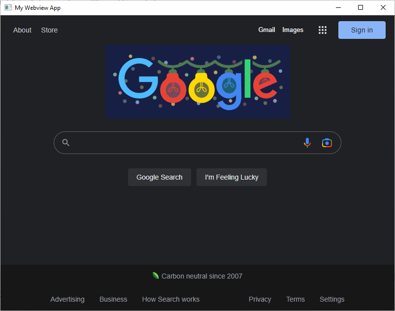

# Webview

The Java port of the [webview project](https://github.com/webview/webview). It is a rewrite of [webview java](https://github.com/webview/webview_java) and uses FFI instead of JNA to access the required dll/dylib/so libraries for your current system.



## Examples

[Example](https://github.com/hivevm/webview/blob/main/core/src/test/java/org/hivevm/webview/Example.java)  

## Supported Platforms

| Platform |
| --- |
| x86, x86_64 |
| aarch64, x86_64 |
| x86, x86_64, arm, aarch64 |

### Linux
Both MUSL and GLibC are supported out of the box. So it should work fine under distros like Debian, Arch, and Alpine.

### macOS

macOS requires that all UI code be executed from the first thread, which means you will need to launch Java with `-XstartOnFirstThread`. This also means that the Webview AWT helper will NOT work at all.

## Getting the code

[](https://jitpack.io/#webview/webview_java)

Replace `_VERSION` with the latest version or commit in this repo. If you want the Bridge bindings you'll need both `core` and `bridge`.

<details>
  <summary>Maven</summary>
  
```xml
<repositories>
    <repository>
        <id>jitpack.io</id>
        <url>https://jitpack.io</url>
    </repository>
</repositories>

<dependency>
    <groupId>com.github.webview.webview_java</groupId>
    <artifactId>core</artifactId>
    <version>_VERSION</version>
</dependency>
```
</details>

<details>
<summary>Gradle</summary>

```gradle
allprojects {
  repositories {
    maven { url 'https://jitpack.io' }
  }
}

dependencies {
  implementation 'com.github.webview.webview_java:core:_VERSION'
}
```

</details>

<details>
  <summary>SBT</summary>

```sbt
resolvers += "jitpack" at "https://jitpack.io"

libraryDependencies += "com.github.webview.webview_java" % "core" % "\_VERSION"
```

</details>

<details>
<summary>Leiningen</summary>

```lein
:repositories [["jitpack" "https://jitpack.io"]]

:dependencies [[com.github.webview.webview_java/core "_VERSION"]]
```

</details>


## Building against Webview

We are using *JExtract* to generate the headers for FFI (Foreign Function Interface) 

### Using JExtract with FFI

Obtain the tool from the following site:

https://jdk.java.net/jextract/

Obtain the source code for jextract from the following site:

https://github.com/openjdk/jextract

~~~
bin/jextract -l webview --output sources -I PATH_TO_INCLUDE/include -t org.webview PATH_TO_INCLUDE/webview.h
~~~

see examples https://github.com/openjdk/jextract/blob/master/samples/sqlite/SqliteMain.java